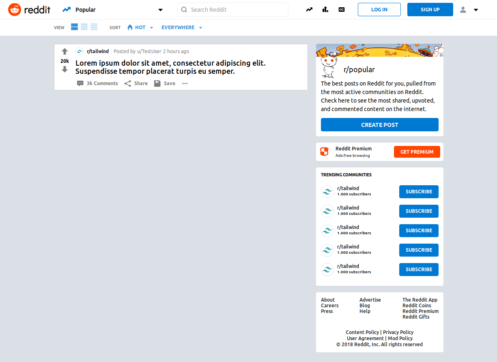

# Reddit with Tailwind CSS
These days I have been playing with [Tailwind CSS](https://tailwindcss.com/) and I made this clone of Reddit. I know that is not perfect, because some things are missing (currently, it is not responsive), but I learnt a lot.

Icons are from [Reddit.com HTML source](https://www.reddit.com) and [Zondicons](http://www.zondicons.com/)

